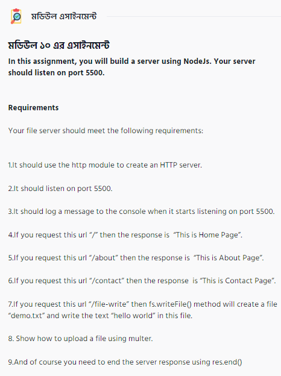

# Ostad MEARN 5 Module 10 Assignment



Run the Assignment using cli

```
cd Assignment
node index.js
```

For testing using **Postman** there is jsonfile for postman in **'PostMan File'**

All URL Request

| Name | Request Method | URL | Key Name | Key Type |
| --- | --- | --- | --- | --- |
| Home Page | GET | http://localhost:5500/ |  |  |
| About Page | GET | http://localhost:5500/about |  |  |
| Contact Page | GET | http://localhost:5500/contact |  |  |
| File Write Page | GET | http://localhost:5500/file-write |  |  |
| File Upload Page | Get | http://localhost:5500/file-upload |  |  |
| Upload | POST | http://localhost:5500/upload | myFile | file |
    
